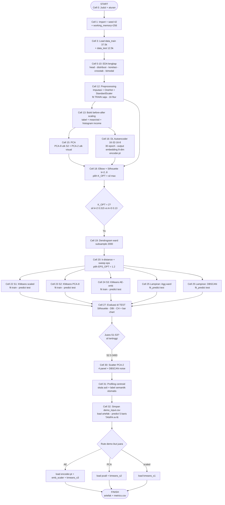

# Flowchart Full — Notebook Customer Segmentation

> Cerminan 1:1 dari `customer_segmentation_unsupervised.ipynb` (33 cell).
> Setiap node mencantumkan nomor cell. Render diagram di GitHub / VS Code Markdown Preview.

## Diagram utama (start → finish)

## Percabangan dan keputusan

| Titik cabang | Pilihan | Di kode | Hasil aktual |
|---|---|---|---|
| Representasi fitur | Scaled 16-dim / PCA-8 / AE-emb 8-dim | Cell 12/15/16 | 3 jalur paralel ke K-Means |
| K_OPT | k=2..8, silhouette max (train) | Cell 18 | k=2 (0,315 vs 0,13) |
| EPS_OPT | sweep 0,8–2,0, min_samples=10 | Cell 20 | eps=1,2 |
| Juara | silhouette tertinggi S1–S3 (test) | Cell 27 | S2 (0,3493) |
| Rute demo | cabang `if "AE" / elif "PCA" / else` | Cell 32 | jalur PCA (prediksi `[0,0,0,0,1]`) |
| DBSCAN noise | label −1 dikecualikan dari metrik | Cell 27 `scores()` | noise dilaporkan terpisah |

## Batas tegas ML vs DL (untuk slide)

- **DL (kuning): hanya Cell 16** — Autoencoder berhenti di `encoder.pt` / `emb_*.npy`.
- **ML klasik (biru): Cell 18–25** — K-Means / Agglomerative / DBSCAN penentu klaster.
- Tidak ada panah dari DL ke keputusan klaster selain sebagai input fitur S3.

## Pemetaan cell → file output

| Cell | Output |
|---|---|
| 12 | `artifacts/preprocessor.joblib` |
| 15 | `artifacts/pca8.joblib`, `pca2.joblib` |
| 16 | `artifacts/encoder.pt`, `autoencoder.pt`, `emb_train.npy`, `emb_test.npy`, `emb_scaler.joblib` |
| 22/23/24 | `artifacts/kmeans_s1/s2/s3.joblib` |
| 25 | `artifacts/dbscan.joblib` |
| 27 | `artifacts/metrics.csv` |
| 32 | `demo_input.csv` + prediksi demo |
