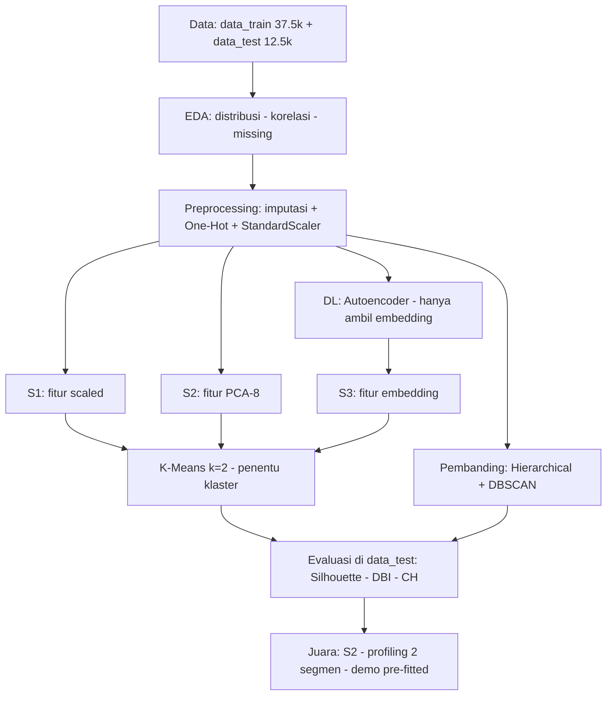
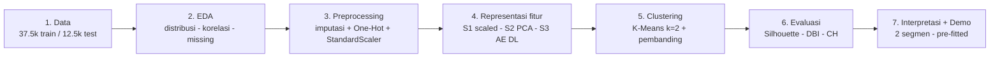
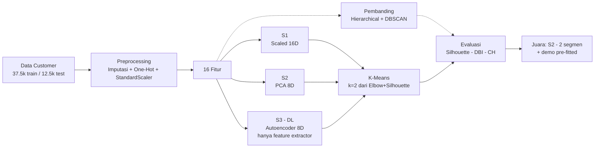

# Flowchart — Pengelompokan Pelanggan (Garis Besar)

> Versi ringkas selevel fase. Detail per cell ada di git history (`FLOWCHART.md` versi detail).

## Keputusan kunci (3 saja)

| Keputusan | Hasil |
|---|---|
| k optimal (Elbow + Silhouette) | k = 2 |
| eps DBSCAN (k-distance) | 1,2 |
| Juara (silhouette tertinggi) | S2 K-Means + PCA-8 (0,3493) |

## Batas ML vs DL

- **DL**: Autoencoder berhenti di embedding — tidak menentukan klaster.
- **ML klasik**: K-Means (utama) + Hierarchical + DBSCAN (pembanding).

## Versi slide (disarankan — berorientasi PROSES, bukan kandidat)

Prinsipnya: S1/S2/S3 cukup disebut sebagai isi tahap 4 (satu baris), detail
perbandingannya hidup di **tabel hasil**, bukan di diagram. Pembanding
Hierarchical/DBSCAN disebut sekali di tahap 5. Dengan begini diagram ramping,
tidak terlihat "metodenya banyak banget", dan tidak ada yang disembunyikan.

## Versi alternatif (jika juri minta kandidat terlihat)

Catatan dari review draf: (1) kotak S3 wajib dilabel DL + beda warna (kuning) — di
drafmu DL-nya "tak terlihat" padahal S3 Autoencoder itulah komponen DL; (2) tambah
cabang putus-putus Hierarchical/DBSCAN sebagai pembanding agar tidak dikira
disembunyikan; (3) tambah sumber k=2 dan output akhir (2 segmen + demo).
