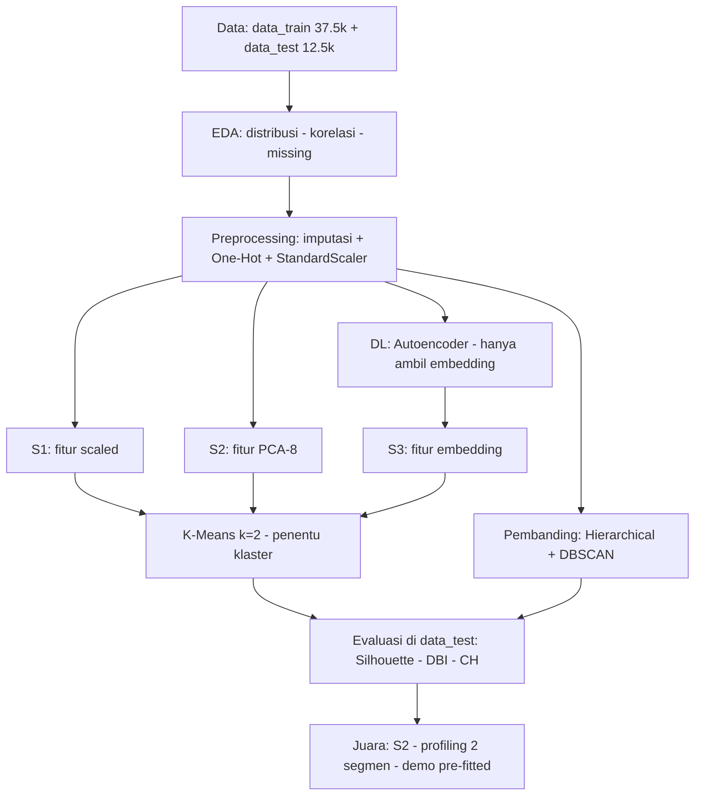

# Flowchart — Pengelompokan Pelanggan (Garis Besar)

> Versi ringkas selevel fase. Detail per cell ada di git history (`FLOWCHART.md` versi detail).

## Keputusan kunci (3 saja)

| Keputusan | Hasil |
|---|---|
| k optimal (Elbow + Silhouette) | k = 2 |
| eps DBSCAN (k-distance) | 1,2 |
| Juara (silhouette tertinggi) | S2 K-Means + PCA-8 (0,3493) |

## Batas ML vs DL

- **DL**: Autoencoder berhenti di embedding — tidak menentukan klaster.
- **ML klasik**: K-Means (utama) + Hierarchical + DBSCAN (pembanding).
