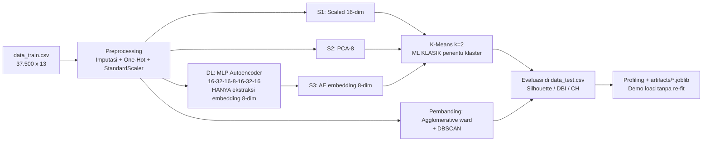

# Panduan Slide Presentasi — Customer Segmentation (Unsupervised + DL Extractor)

> File ini BUKAN slide-nya, melainkan **contekan isi per slide**: judul, poin yang ditulis,
> visual yang dipasang, dan narasi 10 menit. Semua angka di bawah adalah **hasil aktual**
> dari `customer_segmentation_unsupervised.ipynb` (evaluasi di `data_test.csv`, 12.500 baris).
> Estimasi waktu total: **10 menit** (±1 menit/slide, slide hasil 2 menit).

---

## Slide 1 — Judul, Kelompok, Anggota (±30 detik)

**Tulis:**
- Judul: *Segmentasi Pelanggan dengan Clustering Klasik Berbantuan Deep Learning Feature Extractor*
- Kelompok: [Nama/No. Kelompok] — LBE KCV 2026
- Anggota + NIM: [1] … [2] … [3] … [4] …
- Link repo: `github.com/fardanhafidz/customer-segmentation-lbe-kcv`

**Narasi:** "Kami menyelesaikan segmentasi pelanggan tanpa label, dengan K-Means sebagai
penentu klaster dan autoencoder hanya sebagai pengekstrak fitur — sesuai batasan teknis."

---

## Slide 2 — Latar Belakang (±1 menit)

**Tulis (3–4 bullet):**
- Pelanggan heterogen: ada yang baru/transaksional kecil vs loyal/belanja besar — promosi
  yang sama untuk semua tidak efisien.
- Data pelanggan **tidak punya label segmen**, jadi solusinya *unsupervised learning*.
- Algoritma berbasis jarak (K-Means, Hierarchical, DBSCAN) sensitif skala → butuh
  standardisasi; fitur mentah belum tentu representasi terbaik → uji PCA dan embedding DL.
- Aturan proyek: penentu klaster wajib ML klasik; DL hanya boleh preprocessing.

**Visual:** 1 gambar ilustrasi segmen pelanggan (bebas) + 1 histogram `monthly_spend`
(screenshot dari notebook Bagian A — distribusinya bimodal, mendukung ada 2 rezim).

---

## Slide 3 — Rumusan Masalah (±1 menit)

**Tulis (numbering, 3 rumusan):**
1. Bagaimana mengelompokkan 37.500 pelanggan latih ke segmen bermakna **tanpa label**?
2. Representasi fitur mana yang terbaik: fitur scaled mentah, PCA, atau embedding
   Autoencoder — dan algoritma mana yang paling valid (K-Means vs Hierarchical vs DBSCAN)?
3. Bagaimana menyajikan hasil yang siap demo (model pre-fitted, tanpa training ulang)?

---

## Slide 4 — Solusi (±1 menit)

**Tulis:**
- Pipeline: imputasi median/modus → One-Hot → **StandardScaler** → 3 representasi →
  **K-Means (k=2)** sebagai penentu akhir + Agglomerative & DBSCAN sebagai pembanding.
- Kunci kepatuhan: **MLP Autoencoder berhenti di embedding** — tidak pernah menentukan klaster.
- Output: 2 segmen + profil semantik + artefak `artifacts/` siap load untuk demo.

---

## Slide 5 — Dataset (±1 menit)

**Tulis (tabel + bullet):**

| Aspek | Detail |
|---|---|
| Sumber | Panitia LBE KCV |
| Split | `data_train.csv` 37.500 × 13 (fit) / `data_test.csv` 12.500 × 13 (evaluasi) |
| Fitur numerik (10) | `age_years, income_value, tenure_months, monthly_spend, purchase_rate, order_value, promo_usage_rate, return_rate, browse_minutes, support_contacts` |
| Fitur kategorikal (2) | `payment_channel` (A/B/C), `market_area` (A/B/C) + `record_id` |
| Missing | 4–8% di 7 kolom (terbesar `browse_minutes` 8,0%) → imputasi median/modus |
| Preprocessing | `SimpleImputer` + One-Hot + `StandardScaler` (fit **hanya** di train) |

**Visual:** screenshot bar-chart missing value dari notebook.

---

## Slide 6 — Metode (±1 menit)

**Tulis:**
- **K-Means (utama):** Elbow + Silhouette k=2..8 → **k=2** (silhouette train 0,315; k=3 anjlok ke 0,13).
- **Agglomerative (ward):** dendrogram subsample 2.000 (full 37k tidak feasible O(n²)).
- **DBSCAN:** k-distance graph (k=10) + sweep eps → **eps=1,2, min_samples=10**.
- **Evaluasi intrinsik di TEST:** Silhouette↑, Davies–Bouldin↓, Calinski–Harabasz↑.
- Seed `42` di semua tahap → hasil reproducible (terbukti identik di venv bersih).

---

## Slide 7 — Flowchart / Arsitektur (±1 menit) — wajib pisahkan ML dan DL

**Visual:** salin diagram Mermaid ini ke slide (warnai kotak DL kuning, ML biru):

**Narasi penekanan:** "Garis tegasnya di sini — deep learning berhenti di embedding.
Yang memutuskan klaster 0/1 selalu K-Means."

---

## Slide 8 — Hasil Eksperimen (±2 menit) — minimal 3 skenario

**Tulis (tabel utama, TEST):**

| Skenario | Silhouette↑ | DBI↓ | CH↑ | Distribusi test |
|---|---|---|---|---|
| S1 K-Means scaled | 0,3132 | 1,3317 | 5.641 | 0:8.8xx / 1:3.6xx |
| **S2 K-Means + PCA-8 (JUARA)** | **0,3493** | **1,1738** | **6.999** | 0:8.826 / 1:3.674 |
| S3 KMeans + AE-emb | 0,3386 | 1,2439 | 6.143 | 0:3.666 / 1:8.834 |
| Lampiran Agg-ward | 0,3128 | 1,3295 | 5.592 | 0:8.894 / 1:3.606 |
| Lampiran DBSCAN | 0,0800 | 1,9652 | 172 | + noise |

**Profil segmen (S2, skala asli) — hafalkan ini untuk tanya jawab:**
- **Klaster 1 — Loyal High-value (~29%):** tenure ±70 bln, spend ±Rp716/bln,
  purchase rate ±14,6, income ±93,5 jt, promo rendah (0,17).
- **Klaster 0 — Promo-sensitive / low-engagement (~71%):** tenure ±8 bln, spend ±Rp71/bln,
  purchase rate ±1,1, order value tinggi (±128 — jarang tapi besar), promo tinggi (0,42).
- Channel & area **tidak membedakan** (proporsi A/B/C hampir sama di kedua klaster).

**Visual:** screenshot (1) bar-chart 3 metrik, (2) scatter PCA-2 empat panel dari notebook.

**Narasi:** "S2 menang di ketiga metrik; S3 runner-up — bukti embedding DL valid sebagai
preprocessing; DBSCAN menemukan noise tapi skor intrinsik jatuh, jadi tidak dipilih."

---

## Slide 9 — Kesimpulan dan Keterbatasan (±1 menit)

**Kesimpulan (3 bullet):**
1. Pelanggan terbagi 2 segmen stabil di semua skenario: *Loyal High-value* vs
   *Promo-sensitive/low-engagement* — aksi bisnis: retensi/VIP vs promo aktivasi.
2. Representasi terbaik = PCA-8 (S2); embedding Autoencoder (S3) kompetitif dan sah
   sebagai komponen DL sesuai aturan.
3. Seluruh artefak pre-fitted → demo instan via `demo_input.csv`.

**Keterbatasan (jujur, 4 bullet — ini yang sering ditanya juri):**
1. k=2 sederhana — struktur lebih halus (mis. 3–4 segmen) tidak tertangkap silhouette.
2. Hierarchical hanya subsample (O(n²)); DBSCAN sensitif eps.
3. Evaluasi intrinsik tanpa ground truth — validasi bisnis tetap perlu.
4. Imputasi median + AE ringan 30 epoch — masih bisa di-tuning.

---

## Slide 10 — Pembagian Tugas (±30 detik)

**Tulis (sesuaikan nama):**

| Anggota | Tugas |
|---|---|
| [Nama 1] | Preprocessing, scaling, PCA + Bagian A notebook |
| [Nama 2] | MLP Autoencoder (DL extractor) + embedding |
| [Nama 3] | Eksperimen K-Means / Hierarchical / DBSCAN + tuning |
| [Nama 4] | Evaluasi, visualisasi, profiling + slide & demo |

**Catatan:** "Sesuai aturan, seluruh anggota wajib mampu menjelaskan kode dan pilihan
teknis saat tanya jawab" — pakai file ini + README sebagai contekan.

---

## Lampiran — Jawaban tanya jawab yang diprediksi

1. *"Kenapa k=2, bukan 4-5?"* → Silhouette train maksimal di k=2 (0,315); k=3 anjlok
   ke 0,13. Elbow turun landai tanpa siku tajam. Data memang bimodal (tenure & spend).
2. *"Di mana deep learning-nya?"* → MLP Autoencoder 16-32-16-**8**-16-32-16, MSE,
   Adam, 30 epoch; outputnya hanya embedding (`encoder.pt`). Klaster tetap K-Means.
3. *"Kenapa DBSCAN jelek?"* → Bukan jelek — ia menemukan noise/outlier sesuai fungsinya,
   tapi metrik intrinsik pada titik non-noise (sil 0,08) kalah dari struktur globular
   yang cocok untuk K-Means.
4. *"Bukti reproducible?"* → Seed 42 everywhere; notebook di-run ulang di venv bersih
   menghasilkan metrik **identik**; evaluasi selalu di test, bukan train.
5. *"Demo-nya bagaimana?"* → Cell terakhir: load `preprocessor + pca8 + kmeans_s2`,
   predict 5 baris `demo_input.csv`, keluar label instan `[0, 0, 0, 0, 1]`.
